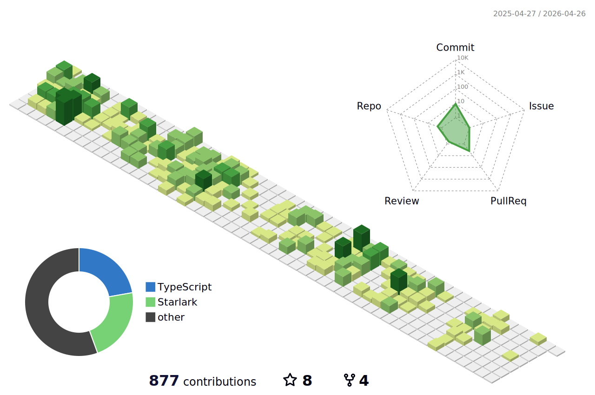

  

  
- 👋 Hi, I’m @jettcc, a backend developer
- I’m currently learning golang、java and distributed system
- I used to work at WeChat.Tencent/WXG/WeCom
- reach me jetttcc@gmail.com

<!---
jettcc/jettcc is a ✨ special ✨ repository because its `README.md` (this file) appears on your GitHub profile.
You can click the Preview link to take a look at your changes.
--->
