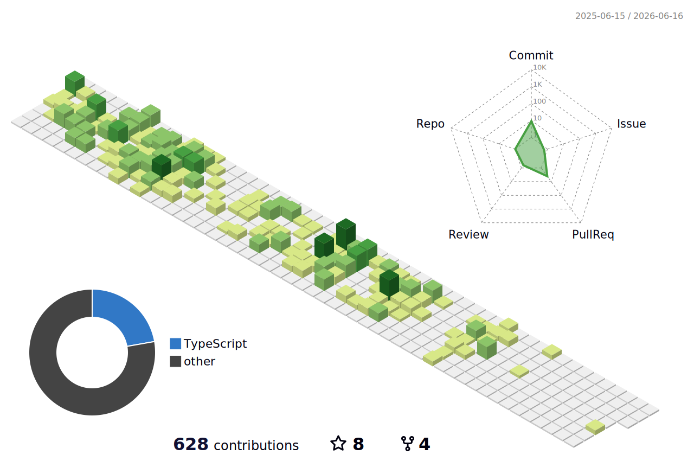

<!--
<div style="display: flex;justify-content: space-around;align-items: center;">
-->
<h1 align="center"> <a href="#"> </a> </h1>

<!--
|  |  |
| ------------- | ------------- |
-->
<!--START_SECTION:waka-->


📊 **本周消耗时间** 

```text
🕑︎ 时区: Asia/Shanghai

💬 编程语言: 
Protocol Buffer          1 hr 24 mins        ⣿⣿⣿⣿⣿⣿⣿⣀⣀⣀⣀⣀⣀⣀⣀⣀⣀⣀⣀⣀⣀⣀⣀⣀⣀   28.85 % 
SQL                      1 hr 15 mins        ⣿⣿⣿⣿⣿⣿⣀⣀⣀⣀⣀⣀⣀⣀⣀⣀⣀⣀⣀⣀⣀⣀⣀⣀⣀   25.78 % 
Other                    44 mins             ⣿⣿⣿⣿⣀⣀⣀⣀⣀⣀⣀⣀⣀⣀⣀⣀⣀⣀⣀⣀⣀⣀⣀⣀⣀   15.17 % 
Markdown                 34 mins             ⣿⣿⣿⣀⣀⣀⣀⣀⣀⣀⣀⣀⣀⣀⣀⣀⣀⣀⣀⣀⣀⣀⣀⣀⣀   11.86 % 
Go                       32 mins             ⣿⣿⣿⣀⣀⣀⣀⣀⣀⣀⣀⣀⣀⣀⣀⣀⣀⣀⣀⣀⣀⣀⣀⣀⣀   11.16 % 
```


 Last Updated on 23/03/2026 00:27:30 UTC
<!--END_SECTION:waka-->

<ul align="left">
<li>
  <p></p>
  👋 Hi, I’m @jettcc, a backend developer
</li>
<li>
  <p></p>
  📖 I’m currently learning golang bazel and ES
</li>
<li>
  <p></p>
  🧑‍💻 I used to work at Tencent/IEG/<a href="https://timi.qq.com">Timi</a> and Tencent/WXG/<a href="https://work.weixin.qq.com">WeCom</a>, and now I am working at <a href="https://www.moego.pet">MoeGo</a>/CRM-team.
</li>
<p></p>
</ul>


<!---

jettcc/jettcc is a ✨ special ✨ repository because its `README.md` (this file) appears on your GitHub profile.
You can click the Preview link to take a look at your changes.
-->
